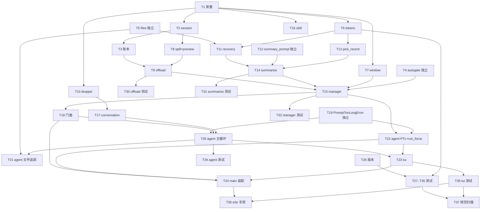

# MewCode ch08 — 上下文管理 任务拆解 (task.md)

> 约定：本项目为 Python，所有验证命令在 Git Bash 下需先 `export PYTHONIOENCODING=utf-8`（见 CLAUDE.md）。
> **异步测试标记跟 repo 现有约定**：仓库已有测试一律用 `@pytest.mark.anyio`（非 `@pytest.mark.asyncio` / `pytest-asyncio`），见 `tests/test_agent.py`、`tests/test_tools.py`。ch08 新测试必须沿用 `@pytest.mark.anyio`。
> 测试遵循 CLAUDE.md 测试规范：用 mock 驱动**真实代码路径**，不依赖真实 API key / 真实终端 / 网络；每个测试 docstring 注明防的 bug。
> 凡需真实 LLM API key 才能验证的行为（T37 端到端真跑、探测脚本真探测）列「待人工验证」，**不混入可自动验证任务的「通过」**。
> docs 保护：本文件是 mew-spec 流程产物（允许写入）；其余测试/验证过程不改动 docs/ 下任何已存在文件。

## 文件清单

| 路径 | 类型 | 职责 |
|------|------|------|
| `mewcode/context/__init__.py` | 新建 | 门面导出 |
| `mewcode/context/constants.py` | 新建 | 全部硬编码阈值常量 |
| `mewcode/context/session.py` | 新建 | `SessionContext` / `SessionPaths` / `new_session_context` |
| `mewcode/context/replacement.py` | 新建 | `ContentReplacementState`（`decide_once` 账本） |
| `mewcode/context/autogate.py` | 新建 | `AutoCompactGate`（仅自动路径连续失败闸） |
| `mewcode/context/files.py` | 新建 | `FileTracker` + `TrackedFile`（锁保护） |
| `mewcode/context/tokens.py` | 新建 | 纯函数 `estimate_tokens` / `usage_to_anchor` / `estimate_messages` / `message_chars` |
| `mewcode/context/window.py` | 新建 | `get_context_window_for_model` 四级解析 |
| `mewcode/context/capabilities.py` | 新建 | 静态能力表 `CAPABILITIES` |
| `mewcode/context/offload.py` | 新建 | `offload_and_snip` / `spill_single` / `build_preview` |
| `mewcode/context/dropper.py` | 新建 | `MessageGroupDropper`（F27 丢消息组） |
| `mewcode/context/recovery.py` | 新建 | `RecoveryBuilder` + `RecoveryBundle` + `BOUNDARY_NOTICE` |
| `mewcode/context/summarize.py` | 新建 | `Summarizer` / `SummarizeConfig` / `CompactOutcome` / `pick_recent_tail` / `ptl_retry` |
| `mewcode/context/manager.py` | 新建 | `ContextManager`（manage_context / compact_now / force_compact / update_anchor） |
| `mewcode/context/skill.py` | 新建 | `Skill` + `SkillRegistry`（骨架，TODO） |
| `scripts/probe_context_window.py` | 新建 | 独立探测脚本（不在主流程，手工回填能力表） |
| `mewcode/conversation/manager.py` | 修改 | `get_messages_ref` / `replace_history` / `_trim` 不拆对降级 |
| `mewcode/agent/events.py` | 修改 | `CONTEXT_COMPACTING` / `COMPACT_FAILED` 事件 |
| `mewcode/agent/agent.py` | 修改 | `_run_lock` 贯穿 / manage_context 钩子 / 文件追踪回填 / PTL 兜底 / run_force_compact / update_anchor / emit 事件 |
| `mewcode/llm/__init__.py` | 修改 | 新增 `PromptTooLongError` 哨兵异常 |
| `mewcode/prompt/assembler.py` | 修改 | `PromptPayload.max_output_tokens` 字段 |
| `mewcode/provider/anthropic.py` | 修改 | PTL 识别（`PromptTooLongError`）/ max_output_tokens 透传 |
| `mewcode/provider/openai.py` | 修改 | PTL 识别（`PromptTooLongError`） |
| `mewcode/tui/app.py` | 修改 | `BUILTIN_COMMANDS` 注册表 / `/compact` / 压缩 UX / 熔断菜单 |
| `mewcode/main.py` | 修改 | 构造 `ContextManager` 注入 Agent |
| `mewcode/__init__.py` | 修改 | `__version__` 升 `0.8.0` |
| `pyproject.toml` | 修改 | `version` 升 `0.8.0` |
| `.gitignore` | 修改 | 追加 `.mewcode/sessions/` |
| `tests/test_context_tokens.py` | 新建 | token 纯函数单测 |
| `tests/test_context_window.py` | 新建 | 四级解析单测 |
| `tests/test_context_session.py` | 新建 | 会话 id + 目录单测 |
| `tests/test_context_replacement.py` | 新建 | 账本四子项 + 并发单测 |
| `tests/test_context_autogate.py` | 新建 | 自动闸单测 |
| `tests/test_context_files.py` | 新建 | 文件追踪 + 并发单测 |
| `tests/test_context_dropper.py` | 新建 | 分组/丢组单测 |
| `tests/test_context_offload.py` | 新建 | 第一层单测（F1/F2/F2a/F3/F4/F5） |
| `tests/test_context_recovery.py` | 新建 | 恢复段单测 |
| `tests/test_context_summarize.py` | 新建 | 摘要/合并 user/role 衔接/PTL 重试单测 |
| `tests/test_context_manager.py` | 新建 | 编排/自动/手动/紧急/闸/互斥单测 |
| `tests/test_context_skill.py` | 新建 | Skill 骨架单测 |
| `tests/test_conversation_manager.py` | 修改 | `get_messages_ref` / `replace_history` / `_trim` 不拆对 |
| `tests/test_provider_ptl.py` | 新建 | `PromptTooLongError` 两家识别 + `__cause__` |
| `tests/test_agent_context.py` | 新建 | Agent 集成：_run_lock / 钩子 / PTL 兜底 / 文件追踪 / emit |
| `tests/test_tui_compact.py` | 新建 | /compact 路由 / UX / 熔断菜单（mock agent） |

---

## T1 - 子包骨架与常量

- **文件**：`mewcode/context/__init__.py`（空门面）、`mewcode/context/constants.py`
- **依赖**：无
- **步骤**：
  1. 新建 `mewcode/context/` 目录，放空 `__init__.py`（后续 T18 按导出需求填充）。
  2. `constants.py` 定义全部硬编码常量（模块级变量非字面常量，便于单测 monkeypatch）：
     `SINGLE_RESULT_THRESHOLD=50000`（字节，F1）、`AGGREGATE_LIMIT=200000`（字节，F2）、`PREVIEW_MAX_LINES=20`（F4）、`PREVIEW_MAX_BYTES=2048`（F4）、`SUMMARY_RESERVE_TOKENS=20000`（F7）、`AUTO_SAFETY_MARGIN=13000`（F7）、`MANUAL_SAFETY_MARGIN=3000`（F8/F23/F25a）、`RECENT_TOKEN_FLOOR=10000`（F11）、`RECENT_COUNT_FLOOR=5`（F11）、`MAX_RECENT_FILES=5`（F16）、`PER_FILE_TOKEN_BUDGET=5000`（F16）、`SKILL_RECOVERY_BUDGET=25000`（F31）、`COMPACT_RETRY_LIMIT=3`（F28）、`PTL_DIRECT_RETRY_LIMIT=3`（F27）、`PTL_DROP_RATIO=0.2`（F27）、`GROUP_DROP_STEP=2`（F28 菜单）、`AUTO_GATE_LIMIT=3`（自动闸）、`ESTIMATE_CHARS_PER_TOKEN=3.5`（F13）、`ONE_M_WINDOW=1000000`（F29）、`DEFAULT_WINDOW_ANTHROPIC=200000`（F29）、`DEFAULT_WINDOW_OPENAI=128000`（F29）、`CAPABILITY_TABLE_FLOOR=100000`（F29）、`CONTEXT_WINDOW_FLOOR=33000`（F7 下界）。
  3. 每个常量上一行简短中文注释说明含义（不写「参考/取自」等外部引用语）。
- **验证**：`python -c "from mewcode.context import constants; print(constants.SINGLE_RESULT_THRESHOLD)"` → `50000`；`ruff check mewcode/context/constants.py` 无告警。

---

## T2 - SessionContext / SessionPaths / new_session_context

- **文件**：`mewcode/context/session.py`
- **依赖**：T1
- **步骤**：
  1. 定义 `@dataclass SessionContext(session_id: str, spill_dir: str)`。
  2. `new_session_context(workspace: str) -> SessionContext`：`session_id = f"{int(time.time())}-{secrets.token_hex(4)}"`（`secrets` 失败极端情况 `try/except` 退 `random` + `logging.warning`）；`spill_dir = workspace/.mewcode/sessions/<sid>/tool-results`；`Path(spill_dir).mkdir(parents=True, exist_ok=True)`（已存在不报错）。
  3. `class SessionPaths`：`path_for(tool_use_id) -> Path`（空 id 用 `itertools.count` 兜底 `unknown-{n}`）、`ensure_dir()`（`mkdir(parents=True, exist_ok=True)`）、`.fallback_seq`。
- **验证**：`python -c "from mewcode.context.session import new_session_context; print(new_session_context('.'))"` 输出合理且目录存在；`ruff check mewcode/context/session.py` 无告警。

---

## T3 - ContentReplacementState（decide_once 账本）

- **文件**：`mewcode/context/replacement.py`
- **依赖**：T2
- **步骤**：
  1. `ContentReplacementState` 类：`__init__` 内 `# 无需显式锁——Python asyncio 单线程事件循环保证串行`（注释说明）、`_seen_ids: set[str] = set()`、`_replacements: dict[str, str] = {}`。
  2. 唯一高层方法（临界区入口）：

     ```python
     def decide_once(self, tool_use_id, original_content, decide) -> str:
         """持锁完成"查账本 → 决策 → 写账本"原子操作。

         若 id 已 Seen：直接返回账本存量结果（kept → 原 content；
         replaced → _replacements[id]，复用冻结字符串，不重造）。
         若未 Seen：调 decide() 回调（仍持锁）：
           ("kept", _)     → 写 _seen_ids，不写 _replacements；返回原 content。
           ("replaced", p) → 写 _seen_ids + _replacements；返回 preview。
           ("skip", _)     → 都不写；返回原 content（下轮重试，F5b）。
         """
     ```

     `_seen_ids` 与 `_replacements` 写入必须在同一临界区内完成，避免「已 Seen 但 replacement 未写」中间态（N2）。
  3. 辅助 `decision_for(tool_use_id) -> tuple[Literal["replaced","kept","unseen"], str | None]`：offload 预查用。
- **验证**：`ruff check mewcode/context/replacement.py` 无告警；目测 `decide_once` 是唯一临界区入口、`decision_for` 只读。

---

## T4 - AutoCompactGate（自动路径连续失败闸）

- **文件**：`mewcode/context/autogate.py`
- **依赖**：T1
- **步骤**：
  1. `AutoCompactGate` 类：`_consecutive_failures: int = 0`（`# 无需显式锁` 注释；仅自动路径读写）。
  2. 方法：`record_auto_success()`→清零；`record_auto_failure()`→+1；`auto_disabled()`→`_consecutive_failures >= AUTO_GATE_LIMIT`；`reset_on_manual_success()`→清零（手动 /compact 成功解除闸）。
  3. 本类不暴露手动/紧急相关方法（不跨种类）。
- **验证**：`ruff check mewcode/context/autogate.py` 无告警；目测无手动/紧急接口。

---

## T5 - FileTracker + TrackedFile（文件追踪）

- **文件**：`mewcode/context/files.py`
- **依赖**：无
- **步骤**：
  1. `@dataclass TrackedFile(path: str, content: str, timestamp_ns: int)`。
  2. `FileTracker` 类：`_files: dict[str, TrackedFile]`、`_lock: asyncio.Lock`；`async record(path, content)`（`async with self._lock:` 覆盖/新增，`timestamp_ns = time.monotonic_ns()`）；`async recent(limit=5)`（按 `timestamp_ns` 倒序取前 `limit`，返回拷贝）。
- **验证**：`ruff check mewcode/context/files.py` 无告警；目测 `recent` 返回拷贝不暴露内部 dict。

---

## T6 - tokens 纯函数估算

- **文件**：`mewcode/context/tokens.py`
- **依赖**：T1
- **步骤**：
  1. `usage_to_anchor(usage: TokenUsage) -> int`：`input_tokens + output_tokens + cache_creation_input_tokens + cache_read_input_tokens`（四者之和，spec F14 替换不累加）。
  2. `message_chars(msgs: list[Message]) -> int`：累加 `len(msg.content.encode("utf-8"))` + 每个 `msg.tool_calls[i]` 序列化后的字节长度（`json.dumps(..., ensure_ascii=False)`），`None` 安全。
  3. `estimate_tokens(anchor, all_msgs, anchor_msg_len) -> int`：`tail = all_msgs[max(0, anchor_msg_len):]`；返回 `anchor + math.ceil(message_chars(tail) / ESTIMATE_CHARS_PER_TOKEN)`。docstring 注明「all_msgs 必须 L1 之后，否则偏高过早触发 L2」。
  4. `estimate_messages(messages) -> int`：纯 `math.ceil(message_chars(messages) / 3.5)`（摘要请求自检 F23）。
- **验证**：`python -c "from mewcode.context.tokens import estimate_tokens; print(estimate_tokens(0, [], 0))"` → `0`；`ruff check mewcode/context/tokens.py` 无告警。

---

## T7 - Context Window 四级解析 + 能力表

- **文件**：`mewcode/context/window.py`、`mewcode/context/capabilities.py`
- **依赖**：T1
- **步骤**：
  1. `capabilities.py`：`CAPABILITIES: dict[str, int]` 静态表，初始收录少量已知 ≥100K 模型（如 `gpt-4o`→128000、`gpt-4-turbo`→128000），表值旁注释「来源 + 时间」；<100K 不进表。
  2. `window.py`：`get_context_window_for_model(model, protocol) -> int` 四级：
     ① `os.environ.get("CLAUDE_CODE_MAX_CONTEXT_TOKENS")` 非空 → `int(...)`（解析失败 `try/except` 跳下级）；② `"[1m]" in model` → `ONE_M_WINDOW`；③ `CAPABILITIES.get(model)` 存在且 `≥ CAPABILITY_TABLE_FLOOR` → 表值；④ 按 `protocol` 默认（anthropic→200000、openai→128000、其余→200000）。永不抛，任一级异常落第 4 级。
- **验证**：`python -c "from mewcode.context.window import get_context_window_for_model; print(get_context_window_for_model('claude-sonnet-4','anthropic'))"` → `200000`；`ruff check mewcode/context/window.py mewcode/context/capabilities.py` 无告警。

---

## T8 - 第一层：spill_single + build_preview

- **文件**：`mewcode/context/offload.py`
- **依赖**：T2
- **步骤**：
  1. `spill_single(session: SessionContext, tool_use_id: str, content: str) -> None`：`path = Path(session.spill_dir) / tool_use_id`；`path.exists()` 则直接返回（幂等）；否则 `open(path, "xb").write(content.encode("utf-8"))`（**wx 模式**，`FileExistsError` 跳过；失败让 `OSError` 自然抛出）。
  2. `_head_preview(content) -> str`：先 `splitlines(keepends=True)[:PREVIEW_MAX_LINES]`，拼回后若 `len(head.encode("utf-8")) > PREVIEW_MAX_BYTES` 做字节级二次截断（UTF-8 边界用 `errors="ignore"`）。
  3. `build_preview(original_bytes, head, spill_path) -> str`：固定格式——`[content offloaded] original size: N bytes` / `[saved to] <path>` / `[head preview]` / head 内容 / 末尾重读提示「完整内容已保存到上述路径，如需查看请用文件读取工具读取该路径，不要凭头部预览猜测全文」。用 `"\n".join([...])` 保证逐字节稳定。
- **验证**：`python -c "from mewcode.context.offload import build_preview; a=build_preview(60000,'x'*100,'/tmp/f'); assert a==build_preview(60000,'x'*100,'/tmp/f'); print('stable')"` → `stable`；`ruff check mewcode/context/offload.py` 无告警。

---

## T9 - 第一层：offload_and_snip 主体

- **文件**：`mewcode/context/offload.py`
- **依赖**：T3、T8
- **步骤**：
  1. `async def offload_and_snip(messages: list[Message], state: ContentReplacementState, session_paths: SessionPaths) -> int`（返回被替换的项数）：
     - 对 `messages` 中每条 `role=="tool"` 消息取 `tool_use_id = msg.tool_use_id or msg.tool_call_id or ""`。
     - 先 `decision_for(id)`：`replaced`→`msg.content = 冻结预览`（复用不重造）；`kept`→continue；`unseen`→评估。
     - **F2a 三步原子**（未决策项）：同一 assistant 回合的多条 tool 消息按 `tool_use_id` 归属分组（与 assistant 消息 `tool_calls[].id` 配对定回合）；每项按字节倒序，先落单条 `> SINGLE_RESULT_THRESHOLD` 的（F1），再按 `AGGREGATE_LIMIT` 继续落下一项（F2）直到该回合剩余聚合 ≤ 阈值。
     - 落盘→改写→写账本由 `decide_once` 闭包在同一临界区完成：

       ```python
       def _decide():
           try:
               spill_single(session, id_, content)
           except OSError:
               return ("skip", "")   # 不写账本，下轮重试
           preview = build_preview(len(content.encode("utf-8")), _head_preview(content), str(Path(session.spill_dir) / id_))
           return ("replaced", preview)
       new_content = state.decide_once(id_, content, _decide)
       msg.content = new_content
       ```

       任一步失败（spill 错）则三件都不做（保持原文 + 不写账本）。
     - 落盘 I/O 用 `await asyncio.to_thread(...)` 避免阻塞 loop 超 100ms（N1）。
     - 返回被替换的项数。
- **验证**：`ruff check mewcode/context/offload.py` 无告警；目测每个 candidate 只经 `decide_once` 走一次。

---

## T10 - MessageGroupDropper（F27 丢消息组）

- **文件**：`mewcode/context/dropper.py`
- **依赖**：T1
- **步骤**：
  1. `group_by_user(messages) -> list[list[Message]]`：遇 `role=="user"` 开新组（`role=="tool"` 归其前的 user 组；assistant 归当前组）。
  2. `drop_oldest(groups, n)`：`groups[n:]`。
  3. `drop_ratio(groups, ratio)`：`n = max(1, math.ceil(len(groups) * ratio))`；`groups[n:]`（空列表返回 `[]`）。
- **验证**：`ruff check mewcode/context/dropper.py` 无告警；目测分组不拆 tool_use/tool_result 对。

---

## T11 - RecoveryBuilder（恢复段三块）

- **文件**：`mewcode/context/recovery.py`
- **依赖**：T5、T6
- **步骤**：
  1. `@dataclass RecoveryBundle(file_snapshots_text, tools_declaration_text, boundary_notice_text)`——**三块都是 str**（见 plan「合并单条 user 消息」决策）。
  2. `RecoveryBuilder` 类：`async build(file_tracker, tool_defs, skill_registry=None) -> RecoveryBundle`：
     - `file_snapshots_text`：`await file_tracker.recent(MAX_RECENT_FILES)`，每个 content 按 `int(PER_FILE_TOKEN_BUDGET * ESTIMATE_CHARS_PER_TOKEN)` 字符截头部、超长加 `(content truncated)`，拼「路径 + 时间戳 + 片段」多行文本。
     - `tools_declaration_text`：**直接用传入的 `tool_defs` 引用**序列化（`id(defs)` 与 stream 一致，F17），每行 `- <name>: <description>` + 缩进参数 schema JSON（`json.dumps(..., separators=(",",":"), ensure_ascii=False)`）。
     - `boundary_notice_text`：固定文案 `BOUNDARY_NOTICE`（F18）。
     - Skill 分支：`if skill_registry and skill_registry.list():` 按 `SKILL_RECOVERY_BUDGET` 注入——**空实现 + TODO 注释**（F31）。
- **验证**：`ruff check mewcode/context/recovery.py` 无告警；目测 `build` 只读 `tool_defs` 引用不重算。

---

## T12 - 摘要 prompt 构造与解析

- **文件**：`mewcode/context/summarize.py`
- **依赖**：T1
- **步骤**：
  1. `SUMMARY_INSTRUCTION: str` 常量：九段结构 + `<analysis>` 草稿 + `<summary>` 正文 + 「不要调用任何工具，输出纯文本」。
  2. `serialize_conversation(msgs) -> str`：user/assistant 消息 `role: <content>`、assistant 工具调用 `[call <name> id=<id> args=<json>]`、tool 结果 `[result id=<id> is_error=<bool>] <content>`，纯函数。
  3. `build_summary_prompt(msgs) -> list[Message]`：返回 `[Message(role="user", content=SUMMARY_INSTRUCTION + "\n\n[conversation]\n" + serialized)]`（**单条 user**）。
  4. `extract_summary(raw) -> str`：`re.findall(r"<summary>(.*?)</summary>", raw, re.DOTALL)[-1]` strip 返回；找不到 → 返回 raw + `logging.warning`（不硬失败）。
- **验证**：`ruff check mewcode/context/summarize.py` 无告警；目测 `serialize_conversation` 确定性输出。

---

## T13 - pick_recent_tail（双下界 + 不拆对 + role 衔接）

- **文件**：`mewcode/context/summarize.py`
- **依赖**：T6、T12
- **步骤**：
  1. `pick_recent_tail(msgs) -> list[Message]`：从尾倒序累加，直到**累计 token ≥ RECENT_TOKEN_FLOOR 且 条数 ≥ RECENT_COUNT_FLOOR**（两个下界都满足才停，F11 择宽）；配对修正：若 `start_idx` 落在 `role=="tool"`（落单 tool_result），前推到上一个带 `tool_calls` 的 assistant 之前（F12）；返回 `list(msgs[start_idx:])`。
  2. `_join_after_summary(summary_and_recovery: Message, recent: list[Message]) -> list[Message]`：
     - 摘要+恢复消息固定 `role="user"`。
     - `recent` 空 → `[summary_and_recovery]`。
     - `recent[0].role == "user"` → 插 `Message(role="assistant", content="（已加载上下文摘要与恢复信息。请继续。）")` 衔接占位（防 user/user 连续 400）。
     - `recent[0].role == "tool"` → 防御性前移到 assistant 或丢该条。
     - 否则正常拼接。
- **验证**：`ruff check mewcode/context/summarize.py` 无告警；目测 `_join_after_summary` 保证无连续 user。

---

## T14 - Summarizer.summarize（第二层摘要主体）

- **文件**：`mewcode/context/summarize.py`
- **依赖**：T11、T12、T13
- **步骤**：
  1. `@dataclass SummarizeConfig(safety_margin, keep_recent_turns)`；`@dataclass CompactOutcome(triggered, before_tokens, after_tokens, replaced_results, success, failure_reason, messages)`。
  2. `Summarizer.__init__(provider, recovery_builder)`；`async summarize(messages, config, context_window, tool_defs) -> CompactOutcome`：
     - 摘要请求**不传 tools**（F8）：`PromptPayload(stable_prompt=SUMMARY_INSTRUCTION, messages=旧块, tools=None, max_output_tokens=8192)`。
     - **摘要请求自检**（F23）：`estimate_messages(摘要prompt)` `> context_window - SUMMARY_RESERVE_TOKENS - config.safety_margin` → 直接进 `ptl_retry`。
     - `provider.stream(payload)` 独立请求累积 text；`StreamEvent.err` 且 `isinstance(err, PromptTooLongError)` → 走 `ptl_retry`；其他错误 → 失败 outcome。
     - 成功构造新消息列表：**摘要正文 + 恢复三块文本拼成单条 user 消息** → `pick_recent_tail` + `_join_after_summary` → 返回 `CompactOutcome(success=True, messages=新列表)`。
     - 整体 `try/except Exception` 兜底返回失败 outcome（N11）。
  3. `async ptl_retry(msgs, first_err) -> str`（F27，三路径共用）：`group_by_user` 分组 → 最多 `PTL_DIRECT_RETRY_LIMIT` 次每次丢最旧 1 组重试 → 不行再每次 `drop_ratio(0.2)` 直到成功或耗尽；耗尽抛最近 err；不发送空 messages 摘要请求；非 PTL 错误立即上抛。
- **验证**：`ruff check mewcode/context/summarize.py` 无告警；目测摘要请求不更新锚点（`summarize` 内不调 `update_anchor`）。

---

## T15 - ContextManager 窄入口（manage_context / compact_now / force_compact / update_anchor）

- **文件**：`mewcode/context/manager.py`
- **依赖**：T9、T14、T4、T11、T7
- **步骤**：
  1. `ContextManager.__init__(provider, conversation, model, protocol, file_tracker, skill_registry=None, emit_event=None)`：持 `asyncio.Lock`（会话级，F34）、`ContentReplacementState`、`FileTracker`、`Summarizer`、`SessionPaths`、`RecoveryBuilder`、`AutoCompactGate`、`context_window = get_context_window_for_model(model, protocol)`、`_usage_anchor=0`、`_anchor_msg_len=0`。
  2. `async manage_context(tool_defs) -> None`（自动）：
     - **sanity check**：`context_window <= CONTEXT_WINDOW_FLOOR(33000)` → `logging.warning` + 跳过自动 L2 仅 L1（F7 下界）。
     - **自动闸**：`auto_gate.auto_disabled()` → 仅 L1 返回（静默，不弹菜单）。
     - `async with self._lock:`：L1 `offload_and_snip`；L2 检查 `estimate_tokens(anchor, conv.get_messages_ref(), anchor_msg_len) >= context_window - 33000` → emit `CONTEXT_COMPACTING("auto")` → `summarizer.summarize(...)`；成功 → `conv.replace_history` + `reset_anchor()` + `record_auto_success()` + 日志；失败 → `record_auto_failure()` + emit `COMPACT_FAILED(outcome)`。
  3. `async compact_now(tool_defs) -> CompactOutcome`（手动）：`async with self._lock:`；跳阈值/跳自动闸/跳 L1，`summarize(..., SummarizeConfig(safety_margin=MANUAL_SAFETY_MARGIN, keep_recent_turns=6))`；成功 → 替换历史 + `reset_anchor()` + `reset_on_manual_success()` + 返回；失败 → 返回失败 outcome（不计自动闸）。
  4. `async force_compact(tool_defs) -> CompactOutcome`（紧急）：先强制 L1 挪走 50K+（F25）→ `summarize(..., SummarizeConfig(safety_margin=MANUAL_SAFETY_MARGIN, keep_recent_turns=3))`；成功 → 替换历史 + `reset_anchor()` + 重估 `< context_window - 3000` 才允许重试，否则不可恢复失败；失败 → 返回失败 outcome（不计自动闸）。
  5. `update_anchor(usage, conv_len)` / `reset_anchor()`（外部锚点状态；**摘要路径不调 update_anchor**）。
  6. `emit_event` 透传 `CONTEXT_COMPACTING`/`COMPACT_FAILED`（None 时静默）；整体 `try/except Exception` 兜底（N11）。
- **验证**：`ruff check mewcode/context/manager.py` 无告警；目测三路径收尾（自动停触发+报错 / 手动显示失败 / 紧急报错且原请求不重试）。

---

## T16 - Skill 骨架

- **文件**：`mewcode/context/skill.py`
- **依赖**：无
- **步骤**：
  1. `@dataclass Skill(name, description, content="")`；`content` 处 `# TODO(ch08): Skill 内容加载待后续章节实现`。
  2. `SkillRegistry` 类：`register(skill)`、`get(name) -> Skill | None`、`list() -> list[Skill]`、`total_tokens(estimator) -> int`（当前总返回 0）。
- **验证**：`ruff check mewcode/context/skill.py` 无告警；目测 registry 空时注入分支跳过。

---

## T17 - Conversation 改造（get_messages_ref / replace_history / _trim 不拆对）

- **文件**：`mewcode/conversation/manager.py`
- **依赖**：T10（`group_by_user` 复用）
- **步骤**：
  1. 新增 `get_messages_ref() -> list[Message]`：返回 `self._messages` **原始引用**（非副本），供 `offload_and_snip` 就地改写。`get_context()` 保持副本不变。
  2. 新增 `replace_history(new_messages) -> None`：`self._messages = list(new_messages)`（第二层摘要替换整段历史）。
  3. 改 `_trim`（原整对丢弃）为**不拆对 + 降级条数兜底**：用 `MessageGroupDropper.group_by_user` 分组、从头部整组丢弃、天然保对；仅当组数远超 `max_turns` 时触发（主裁剪权已交 context）。
- **验证**：`ruff check mewcode/conversation/manager.py` 无告警；目测 `_trim` 后 tool 结果不落单。

---

## T18 - 子包门面

- **文件**：`mewcode/context/__init__.py`
- **依赖**：T1–T16 全部
- **步骤**：
  1. 导出：`ContextManager`、`AutoCompactGate`、`usage_to_anchor`/`estimate_tokens`/`estimate_messages`/`message_chars`、`get_context_window_for_model`、`ContentReplacementState`、`FileTracker`、`TrackedFile`、`RecoveryBundle`、`SummarizeConfig`/`CompactOutcome`、`Skill`、`SkillRegistry`、`SessionContext`/`SessionPaths`、`new_session_context`、`MessageGroupDropper`、`BOUNDARY_NOTICE`、常量。
  2. docstring 一句：仅依赖 provider.base / conversation / 标准库，不依赖 agent/tui/permission/mcp/config。
- **验证**：`python -c "from mewcode.context import ContextManager, get_context_window_for_model, estimate_tokens, ContentReplacementState, FileTracker, Skill, SkillRegistry; print('ok')"` → `ok`；`ruff check mewcode/context/__init__.py` 无告警。

---

## T19 - PromptTooLongError 哨兵 + provider PTL 包装 + max_output_tokens

- **文件**：`mewcode/llm/__init__.py`、`mewcode/prompt/assembler.py`、`mewcode/provider/anthropic.py`、`mewcode/provider/openai.py`
- **依赖**：无（与 T1–T18 并行）
- **步骤**：
  1. `llm/__init__.py` 顶部新增：

     ```python
     class PromptTooLongError(Exception):
         """Provider 上报上下文超出窗口时统一抛出的哨兵异常。"""
     ```

  2. `prompt/assembler.py`：`PromptPayload` 新增 `max_output_tokens: int | None = None`；`assemble` 透传。
  3. `provider/anthropic.py`：`max_tokens` 读 `payload.max_output_tokens`（None 维持 4096，有值用之）；异常处理识别 PTL（`AnthropicAPIError` 且 `status_code == 400` 且消息含 `prompt is too long`/`context length`）→ `wrapped = PromptTooLongError(...)`、`wrapped.__cause__ = e`、`yield StreamEvent(err=wrapped)`；其余维持原 `ProviderError`。
  4. `provider/openai.py`：识别 PTL（`OpenAIAPIError` 且 `status_code == 400` 且 `code == "context_length_exceeded"` 或消息含 `maximum context length`）→ 同 wrap；其余维持原样。OpenAI 侧 max_tokens 沿用端点默认。
- **验证**：`python -c "from mewcode.llm import PromptTooLongError; print('ok')"` → `ok`；`ruff check mewcode/llm/__init__.py mewcode/prompt/assembler.py mewcode/provider/anthropic.py mewcode/provider/openai.py` 无告警。

---

## T20 - Agent 主循环集成（events + _run_lock + 钩子 + update_anchor + emit）

- **文件**：`mewcode/agent/events.py`、`mewcode/agent/agent.py`
- **依赖**：T18、T17、T19
- **步骤**：
  1. `events.py`：`EventType` 新增 `CONTEXT_COMPACTING`、`COMPACT_FAILED`（payload 分别 str / `CompactOutcome`）。
  2. `agent.py` `__init__`：新增可选 `context_mgr`、`file_tracker`、`emit_event`；`self._run_lock = asyncio.Lock()`；无 context_mgr 时行为与 ch07 一致（N8）。
  3. `run()` 入口 `async with self._run_lock:` **贯穿整轮**（F34）；循环体 `TURN_START` 后、`assemble` 前 `if self._context_mgr: await self._context_mgr.manage_context(tool_defs)`。
  4. 主对话请求成功后：`self._context_mgr.update_anchor(_token_usage, len(self.conv.get_messages_ref()))`（仅主对话路径）。
  5. 压缩状态事件 emit（F24a/F24b）：manage_context 前按需 emit `CONTEXT_COMPACTING`、返回后按结果 emit（自动/紧急路径）。
- **验证**：`ruff check mewcode/agent/events.py mewcode/agent/agent.py` 无告警。

---

## T21 - Agent 文件追踪回填

- **文件**：`mewcode/agent/agent.py`
- **依赖**：T5、T20
- **步骤**：
  1. 工具执行回填处（`add_tool_result` 前，同 task 顺序，F19a）：

     ```python
     if self._file_tracker is not None and tc.tool_name == "read_file" and sr.result.status == "ok":
         await self._file_tracker.record(abs_path, _strip_truncation(sr.result.output))
     await self.conv.add_tool_result(tc, sr.result)
     ```

     `abs_path` 从 `tc.arguments["path"]` 取并 `os.path.abspath`；`_strip_truncation` 剥离 read_file 截断提示行。
- **验证**：`ruff check mewcode/agent/agent.py` 无告警；目测只对 read_file 成功结果触发。

---

## T22 - Agent PTL 兜底 + run_force_compact

- **文件**：`mewcode/agent/agent.py`
- **依赖**：T15、T19、T20
- **步骤**：
  1. `run()` 内 `_stream_error` 处理：`if isinstance(_stream_error, PromptTooLongError):` → `if self._context_mgr and not emergency_retried:`（`emergency_retried` 为 run 内局部变量，F26）→ `emergency_retried = True` → `outcome = await self._context_mgr.force_compact(tool_defs)` → 成功则用新历史重组 payload 重试本轮（不进下一 turn）；失败则 `ERROR + DONE(STREAM_ERROR)`。已 `emergency_retried` 或无 context_mgr → 原错误处理。
  2. 暴露 `async run_force_compact(tool_defs) -> CompactOutcome`：入口 `async with self._run_lock:`（等 run 结束，F34）→ `await self._context_mgr.compact_now(tool_defs)`，供 TUI `/compact` 调用。
- **验证**：`ruff check mewcode/agent/agent.py` 无告警；目测紧急路径不二次 ForceCompact（F26）。

---

## T23 - TUI 命令注册表 + /compact + 压缩 UX + 熔断菜单

- **文件**：`mewcode/tui/app.py`
- **依赖**：T20、T22
- **步骤**：
  1. 抽 `BUILTIN_COMMANDS` 注册表（F21）：`/exit`、`/plan`、`/do`、`/delete-plan`、`/normal`、`/exit-plan` 迁移为注册项（**行为不变**），新增 `/compact`；`_process_input` 改「以 `/` 开头 → 查注册表 → 命中执行 / 未命中未知命令兜底（给可用命令提示，不发 LLM）」。命令路径不写 conversation。
  2. `/compact` 处理：调 `self.agent.run_force_compact(self.agent.registry.to_definitions())`，成功展示「已压缩，token 从 X 降至 Y」（F24）、失败弹熔断菜单（F28 手动路径）。
  3. `_consume_agent_events` 处理新事件：`CONTEXT_COMPACTING` 按 payload 显示「正在压缩上下文...」/「上下文撞墙，自动压缩中...」（F24a/F24b）；`COMPACT_FAILED` 用 `_ask_choice` 弹熔断菜单（重试/分组丢弃重试（标明丢量）/放弃/退出/其他说明），选中「分组丢弃重试」驱动 `MessageGroupDropper` 步进（每次 2 组×3 次→每次 20%，F28 菜单分支）。
  4. `_toolbar` 加 `/compact` 提示文案。
- **验证**：`ruff check mewcode/tui/app.py` 无告警；目测命令路径不写 conversation。

---

## T24 - 装配接入（main.py）

- **文件**：`mewcode/main.py`
- **依赖**：T18、T22、T23
- **步骤**：
  1. `_amain` 构造 `FileTracker()`、`SkillRegistry()`（骨架空）、`ContextManager(provider, conversation, provider.model, provider_config.protocol, file_tracker, skill_registry, emit_event=…)`。
  2. 注入 Agent：`agent = Agent(..., context_mgr=context_mgr, file_tracker=file_tracker)`；`emit_event` 把 context 事件转成既有 `Event` 机制交给事件流。
  3. `_oneshot` 路径同样注入（无 TUI 时自动压缩仍生效）。
- **验证**：`python -m mewcode --version` → `mewcode 0.8.0`；`python -c "import mewcode.main; print('import ok')"`；`ruff check mewcode/main.py` 无告警。

---

## T25 - 独立探测脚本

- **文件**：`scripts/probe_context_window.py`
- **依赖**：无
- **步骤**：
  1. `python scripts/probe_context_window.py --protocol anthropic --model <name> [--base-url …] [--api-key …]`：二分逼近构造逐步增长的填充 prompt 发请求直到 provider 返回 PTL，二分定位边界；stdout 打印结果 + 「经验下界，手工填入 `mewcode/context/capabilities.py`」提示。
  2. **不在 Agent 主流程、不被 import、不被 F29 引用**（F30）。
- **验证**：`python scripts/probe_context_window.py --help` → 正常打印用法退出 0（无需 API key）；`grep -rn "probe_context_window" mewcode/` 无命中。真探测标「待人工验证」（需 API key + 网络，结果手工回填能力表并提交）。

---

## T26 - 版本号与 .gitignore

- **文件**：`mewcode/__init__.py`、`pyproject.toml`、`.gitignore`
- **依赖**：无
- **步骤**：
  1. `__version__` 从 `"0.7.0"` 改 `"0.8.0"`（两处：`__init__.py` + `pyproject.toml`）。
  2. `.gitignore` 追加 `.mewcode/sessions/`。
- **验证**：`python -c "import mewcode; print(mewcode.__version__)"` → `0.8.0`；`grep -n '0.7.0' pyproject.toml mewcode/__init__.py` 无命中。
- **提交：** 版本号变更**独立提交** `chore: bump version to 0.8.0`（CLAUDE.md 硬规则）。

---

## 测试任务（独立，每个含函数级清单）

### T27 - token / window / session 单测

- **文件**：`tests/test_context_tokens.py`、`tests/test_context_window.py`、`tests/test_context_session.py`
- **依赖**：T6、T7、T2
- **步骤**（每个测试 docstring 注明防的 bug）：
  1. `test_tokens.py`：`test_usage_anchor_sum`（四字段求和，`SimpleNamespace` mock，仿 `tests/test_cache_usage.py` 范式）；`test_estimate_tokens_delta_only`（`anchor=1000, msgs=[m1,m2], anchor_msg_len=1` → `1000 + ceil(len(m2)/3.5)`，防「重复算已含进 anchor 的历史」）；`test_estimate_tokens_zero_anchor`（`anchor=0` 退化纯字符）；`test_estimate_messages_chars_only`；`test_estimate_tokens_large_no_overflow`（`anchor=2_000_000_000` 大值，防 int 溢出误解）。
  2. `test_window.py`：`test_env_override`（monkeypatch env 取 env 值）；`test_one_m_suffix`（`[1m]` 取 1M）；`test_capability_table`（表命中取表值）；`test_protocol_default`（anthropic/openai/unknown 三分支）；`test_env_invalid_falls_through`（env 非数字跳下级）；`test_capability_below_floor_falls_through`（临时塞 <100K 表值落默认）。
  3. `test_session.py`：`test_session_id_format`（`^\d+-[0-9a-f]{8}$` 且两次不同）；`test_path_for`（落在 `spill_dir/<id>`）；`test_path_for_empty_fallback`（空 id 兜底名不抛且递增）；`test_ensure_dir_idempotent`。
- **验证**：`python -m pytest tests/test_context_tokens.py tests/test_context_window.py tests/test_context_session.py -q` 全过。

### T28 - replacement / autogate 单测

- **文件**：`tests/test_context_replacement.py`、`tests/test_context_autogate.py`
- **依赖**：T3、T4
- **步骤**（`@pytest.mark.anyio`）：
  1. `test_replacement.py`：`test_decide_once_replaced_freeze`（首评 replaced → 再评同 id 复用 preview、decide 不被二次调（计数闭包断言），防「重造预览字符串破坏缓存」）；`test_decide_once_kept_freeze`（首评 kept → 再评返回原文、永不翻转）；`test_decide_once_skip_not_marked`（skip → 账本不写、下轮重评，防「落盘失败却记账导致永不重试」）；`test_decide_once_concurrent_atomic`（20 task 并发同 id → decide 恰好调一次，防「已 Seen 但 replacement 未写」中间态）。
  2. `test_autogate.py`：`test_consecutive_failures_trips_at_3`（2 次未 disabled、3 次 disabled）；`test_success_resets`（失败 2 次后 success 清零）；`test_manual_success_resets_gate`（`reset_on_manual_success` 从 disabled 恢复）；`test_no_cross_kind_methods`（无手动/紧急公共方法）。
- **验证**：`python -m pytest tests/test_context_replacement.py tests/test_context_autogate.py -q` 全过。

### T29 - files / dropper 单测

- **文件**：`tests/test_context_files.py`、`tests/test_context_dropper.py`
- **依赖**：T5、T10
- **步骤**（`@pytest.mark.anyio`）：
  1. `test_files.py`：`test_record_overwrite`（同 path 覆盖更新）；`test_recent_order`（7 个文件 recent(5) 取最近 5 按时间倒序）；`test_concurrent_record_recent`（20 task 混写读无重复/错乱，防竞态）；`test_recent_returns_copy`（返回拷贝改不坏内部）。
  2. `test_dropper.py`：`test_group_by_user_boundary`（含连续 user 各自成组）；`test_group_keeps_pair`（user→assistant(tool_use)→tool 整组不拆）；`test_drop_oldest`；`test_drop_ratio_min_one`（空/1 组/多组三分支，`drop >= 1`）；`test_drop_all_returns_empty`。
- **验证**：`python -m pytest tests/test_context_files.py tests/test_context_dropper.py -q` 全过。

### T30 - offload 单测（第一层）

- **文件**：`tests/test_context_offload.py`
- **依赖**：T9
- **步骤**（`@pytest.mark.anyio`，`tmp_path` 隔离落盘）：
  `test_single_result_offload`（60000 字节 → 替换为预览、文件落盘、预览含四项信息、头部 ≤20 行且 ≤2048 字节，AC1）；`test_aggregate_offload`（3 条各 80000 → 按大→小落盘直到聚合 ≤200000、替换数=最小达标数，AC2）；`test_spill_idempotent`（同 id 两次 → `os.stat().st_mtime_ns` 不变，AC3）；`test_decision_freeze`（同 id 两轮 → 预览逐字节一致，AC4）；`test_spill_failure_retryable`（monkeypatch `spill_single` 抛 `OSError` → 保持原文、不进账本、下轮重评，AC4 子断言）；`test_three_step_atomic`（落盘失败时 content 未改写 + 账本未写，F2a）。
- **验证**：`python -m pytest tests/test_context_offload.py -q` 全过。

### T31 - recovery / summarize 单测

- **文件**：`tests/test_context_recovery.py`、`tests/test_context_summarize.py`
- **依赖**：T11、T14
- **步骤**（`@pytest.mark.anyio`，mock provider 产出固定 `StreamEvent`）：
  1. `test_recovery.py`：`test_file_snapshot_limit`（7 个 record → 只含最近 5、倒序、第 6/7 路径**不**出现反向断言）；`test_file_truncate`（超 5000 token 只留头部 + `(content truncated)`）；`test_tools_exact_reference`（工具文本与传入 `tool_defs` 集合一致、内部不重算——spy 计数）；`test_boundary_notice_stable`（同入参两次输出逐字节相等）。
  2. `test_summarize.py`：`test_summary_request_no_tools`（provider 收到 `PromptPayload.tools is None`，AC6）；`test_extract_summary_only`（只留 `<summary>` 正文，含 9 小节 + 第 6 节用户原文，AC7）；`test_merge_single_user_message`（摘要+恢复合并单条 user、全程无连续 user，AC8a）；`test_role_join_placeholder`（近期原文首条 user → 插 assistant 占位，AC8a）；`test_recent_tail_dual_floor`（token≥10000 且 条数≥5 双下界、首条非落单 tool_result，AC8）；`test_ptl_retry_drops_groups`（前 3 次每次丢 1 组、之后比例，F27，防「不丢组直接撞墙」）；`test_ptl_retry_stops_before_empty`（全丢光抛错、不发送空 messages 摘要请求）；`test_summary_does_not_update_anchor`（spy 断言 summarize 内不调 `update_anchor`，防「摘要 usage 污染主对话锚点」）。
- **验证**：`python -m pytest tests/test_context_recovery.py tests/test_context_summarize.py -q` 全过。

### T32 - manager 单测（编排）

- **文件**：`tests/test_context_manager.py`
- **依赖**：T15
- **步骤**（`@pytest.mark.anyio`，fake provider + fake conversation）：
  `test_auto_triggers_on_threshold`（AC5）；`test_auto_skipped_below_threshold`（`summarize_calls == 0`）；`test_auto_uses_layer1_output`（L1 替换后重估跌到阈值以下不再触发 L2，防「用 L1 前估算偏高过早触发」）；`test_auto_skipped_when_gate_disabled`（闸触发跳过 L2）；`test_auto_failure_records_gate`（连续 3 轮失败 → `auto_disabled()`，AC20a）；`test_manual_bypasses_everything`（远低于阈值仍摘要，AC13）；`test_manual_success_resets_gate`（手动成功解除自动闸，AC20a）；`test_emergency_runs_layer1_first`（先强制 L1 挪走 50K+ 再摘要，AC17）；`test_emergency_bypasses_gate`（闸已触发仍能紧急压缩）；`test_context_window_floor_check`（窗口 ≤33000 跳过 L2 + warning，AC5a）；`test_concurrent_manage_and_compact_mutex`（并发调 manage_context 与 compact_now 不交错改写 conversation，F34）。
- **验证**：`python -m pytest tests/test_context_manager.py -q` 全过。

### T33 - skill / conversation / provider_ptl 单测

- **文件**：`tests/test_context_skill.py`、`tests/test_conversation_manager.py`、`tests/test_provider_ptl.py`
- **依赖**：T16、T17、T19
- **步骤**（`@pytest.mark.anyio`）：
  1. `test_skill.py`：`test_register_get_list`；`test_total_tokens_zero`（空内容）；`test_get_missing_returns_none`。
  2. `test_conversation_manager.py`（修改）：`test_get_messages_ref_same_object`（`is` 断言 + 改动反映到 `get_context()` 副本）；`test_replace_history_replaces`（旧列表外部持有不影响新列表）；`test_trim_keeps_pair`（含 tool_use/tool_result 对裁剪不拆对，防「_trim 整对丢弃拆配对导致 Anthropic API 报错」）；既有用例不回归。
  3. `test_provider_ptl.py`（mock SDK 客户端）：`test_anthropic_ptl_wrapped` / `test_openai_ptl_wrapped`（典型 PTL → `StreamEvent(err)` 且 `isinstance(err, PromptTooLongError)`）；`test_non_ptl_not_wrapped`（其他 4xx/5xx `isinstance` False，防「误判触发无谓紧急压缩」）；`test_cause_preserved`（`err.__cause__` 是原 SDK 异常）；`test_max_output_tokens_passthrough`（`max_output_tokens=8192` 透传到 anthropic `max_tokens`）。
- **验证**：`python -m pytest tests/test_context_skill.py tests/test_conversation_manager.py tests/test_provider_ptl.py -q` 全过。

### T34 - agent 集成单测

- **文件**：`tests/test_agent_context.py`
- **依赖**：T20、T21、T22
- **步骤**（`@pytest.mark.anyio`，复用 `tests/test_agent.py` 的 MockProvider/MockTool 范式）：
  `test_manage_context_called_each_turn`（spy 断言每轮 assemble 前被调）；`test_backward_compat_without_context_mgr`（不注入时行为与既有一致，N8）；`test_ptl_triggers_force_compact_retry_once`（第 K 次 PTL → force_compact → 新历史重试一次，AC17）；`test_second_ptl_no_second_compact`（重试又 PTL → 上抛不二次，AC18）；`test_read_file_tracks_recovery`（read_file 成功 → file_tracker.record 被调，同 task、add_tool_result 前，F19a）；`test_update_anchor_after_main_stream`（主对话成功后 update_anchor 被调）；`test_emit_compact_events`（自动路径 BEFORE/AFTER 事件顺序 + before>after，F24a）。
- **验证**：`python -m pytest tests/test_agent_context.py -q` 全过。

### T35 - TUI 单测

- **文件**：`tests/test_tui_compact.py`
- **依赖**：T23
- **步骤**（mock agent，`object.__new__` 绕过 PromptSession——遵循 CLAUDE.md 测试规范）：
  `test_compact_routes_to_command`（输入 `/compact` → `run_force_compact_calls == 1`、`run_calls == 0`，不发 LLM 普通请求，AC12）；`test_unknown_command_friendly`（`/unknown` → 友好提示含可用命令、不发 LLM，AC12）；`test_compact_shows_token_delta`（成功显示「已压缩，token 从 X 降至 Y」，AC15）；`test_auto_compacting_notice`（F24a 显示「正在压缩上下文...」）；`test_migrated_commands_no_regression`（`/exit`/`/plan`/`/do` 行为不回归，AC28）。
- **验证**：`python -m pytest tests/test_tui_compact.py -q` 全过。

---

## T36 - 端到端冒烟（tmux 手测）【待人工验证】

- **文件**：无（手测）
- **依赖**：T23、T24、T25
- **步骤**：
  1. `pip install -e .[dev]`；tmux 启动 `python -m mewcode`，配置好 provider。
  2. 触发一次大文件 ReadFile（构造 80KB 文件）→ `.mewcode/sessions/<id>/tool-results/` 出现该工具调用 id 的文件；下一轮请求该工具结果展示为预览体（AC1 端侧）。
  3. 连续多轮对话逼近 context；临时把 `CLAUDE_CODE_MAX_CONTEXT_TOKENS` 设 **80000**（>33000 使自动阈值有效，`80000-33000=47000` 为正）触发自动摘要 → TUI 显示「正在压缩上下文...」→ 完成后「已压缩，token 从 X 降至 Y」，对话继续不闪退（F24a）。
  4. 任意时刻 `/compact` → 显示「已压缩，token 从 X 降至 Y」（F24）。
  5. `/unknown` → 未知命令提示，未发 LLM（F21）。
  6. `/exit` / `/plan` / `/do` → 行为与本章迁移前一致（AC28）。
- **验证（人工）**：以上 6 步全部观察到预期行为，无未捕获异常、无死循环；临时 env 清理恢复。
- **若环境受限无法验证：** 标「待人工验证」，说明原因（无终端/无 API key），替代为 T30/T31/T32/T34 的 mock 覆盖集成层，风险（真实摘要 LLM 调用、真实落盘端侧未在 CI 验证），责任方（开发者有环境时补验）。

---

## T37 - 全量规范与 docs 保护扫描

- **文件**：—
- **依赖**：T27–T35
- **步骤**：
  1. `ruff format --check .` 无 diff；`ruff check .` 无告警。
  2. `python -m pytest -q` 全过（ch01–ch07 既有 + ch08 新测试）。
  3. 并发/收尾守护：`python -m pytest tests/test_context_replacement.py tests/test_context_files.py tests/test_context_manager.py -q` 并发用例无竞态。
  4. `.gitignore` 确认含 `.mewcode/sessions/`；`git status` 确认 sessions 不入库。
  5. **docs 保护自检**：`git status docs/` 仅显示 `docs/ch08/` 新增（四份 mew-spec 流程文档），`git diff docs/` 对既有文档无修改。
- **验证：** 全部通过。

---

## 执行顺序（mermaid）



**并行机会**：
- T4（autogate）、T5（files）、T10（dropper）、T12（summary_prompt）、T16（skill）、T19（PromptTooLongError+provider）、T26（版本）都只依赖 T1 或独立，可与 T2–T15 并行起步。
- T6（tokens）与 T2–T4 可并行；T7（window）与 T2–T6 可并行。
- T17（conversation）只依赖 T10，可与 T9–T16 并行。
- 测试任务 T27–T35 各依赖其对应实现任务，实现完成后即可并行开写（T30 offload 测试可先于 T14/T15 完成）。

**关键路径**：T1 → T2 → T3 → T9 → T15 → T18 → T20 → T22 → T23 → T24 → T36 → T37（约 12 步）。

**提交节奏**（CLAUDE.md「每组逻辑相关任务完成后提交」）：T26 版本号独立提交 `chore: bump version to 0.8.0`；T1+T2+T6+T7（基础层）一组；T3+T9+T8（账本+第一层）一组；T5+T11+T10（追踪+恢复+分组）一组；T12+T13+T14（摘要）一组；T4+T16（闸+Skill）一组；T15+T18（编排+门面）一组；T17（conversation）一组；T19（provider）一组；T20+T21+T22（agent）一组；T23（tui）一组；T24（main）一组；T25（脚本）一组；T27–T35（测试）分模块提交；T36 不产代码改动（不提交）；T37 一组。

## 自检

- **plan 覆盖**：plan 每个组件各 ≥1 任务——constants→T1、session→T2、replacement→T3、autogate→T4、files→T5、tokens→T6、window/capabilities→T7、offload→T8+T9、dropper→T10、recovery→T11、summarize→T12+T13+T14、manager→T15、skill→T16、conversation→T17、门面→T18、llm+provider→T19、agent→T20+T21+T22、tui→T23、main→T24、探测脚本→T25、版本→T26、测试→T27–T35、e2e→T36、规范→T37。✓
- **占位符扫描**：无「类似 TX」模糊引用；步骤具体到函数/方法名与文件级锚点。✓
- **依赖链**：T1→T2→T3→T9→T15→T18→T20→T22→T23→T24→T36→T37 为主链；T5/T4/T10/T12/T16/T19/T26 独立可并行；无环。✓
- **验证完整性**：可自动验证任务均含 ruff format/check + pytest；T36 真跑标「待人工验证」不混入通过；每测试 docstring 注明防的 bug。✓
- **类型一致性**：与 plan.md 一致——`ContextManager.manage_context/compact_now/force_compact/update_anchor/reset_anchor`、`offload_and_snip`、`ContentReplacementState.decide_once/decision_for`、`AutoCompactGate`、纯函数 `estimate_tokens/usage_to_anchor/estimate_messages/message_chars`、`get_context_window_for_model`、`Summarizer.summarize`、`MessageGroupDropper`、`RecoveryBuilder.build`、`FileTracker.record/recent`、`SessionPaths.path_for/ensure_dir`、`replace_history/get_messages_ref`、`PromptTooLongError`、`PromptPayload.max_output_tokens`、`run_force_compact`。✓
- **异步测试标记**：ch08 新测试沿用 repo 约定 `@pytest.mark.anyio`（与 tests/test_agent.py、tests/test_tools.py 一致），非 `pytest-asyncio`。✓
